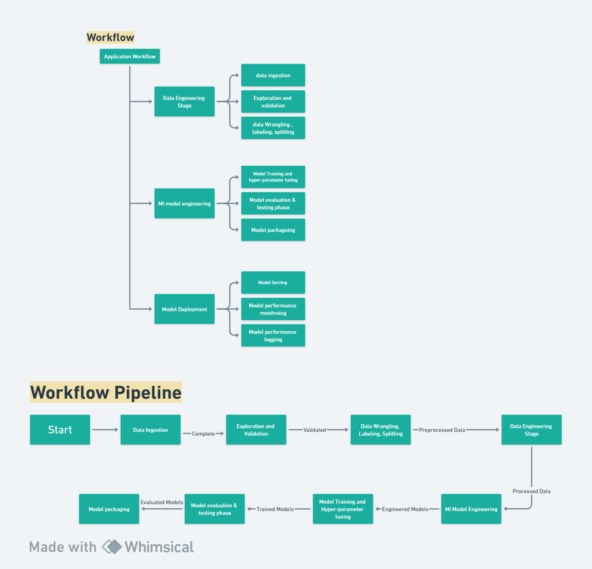

# Generic Sentiment Analysis Application

## Problem Statement

Developing a versatile machine learning model for custom sentiment analysis that accommodates both labeled and unlabeled data. The model should effectively analyze input text, incorporating grammatical nuances, and provide accurate sentiment classifications. This entails creating a system capable of handling diverse datasets, enhancing its adaptability for comprehensive sentiment analysis.

## About the Data

For building this model, we are using the dataset from Kaggle.

Dataset Link: [Twitter Entity Sentiment Analysis](https://www.kaggle.com/datasets/jp797498e/twitter-entity-sentiment-analysis/data)

## Solution

### Defining the Problem

Here, we need to perform sentiment analysis using machine learning and deep learning techniques.

### Why It's Important

For any organization or company, it is crucial to maintain a good relationship with customers/users. Analyzing reviews is a great way to achieve this, as it helps improve both customer relations and brand value in the market.

### End User View

Organizations can monitor product reviews to understand customer satisfaction. By analyzing these reviews, they can improve both customer relations and their brand value in the market.

### Prediction Task

The sentiment analysis application can perform both supervised and unsupervised learning:

1. **Supervised Learning**: This falls under the "classification" type of problem, where the input is a "statement" and the output is a "sentiment". Techniques such as AutoML, LSTM or RNN, and GRU can be used.

2. **Unsupervised Learning**: This falls under "One-Shot classification" using models from Hugging Face. It takes input statements and predicts sentiment. The process involves first performing zero-shot learning on small data, then verifying the data and training our model, which turns it into a supervised task.

## Approach

---

